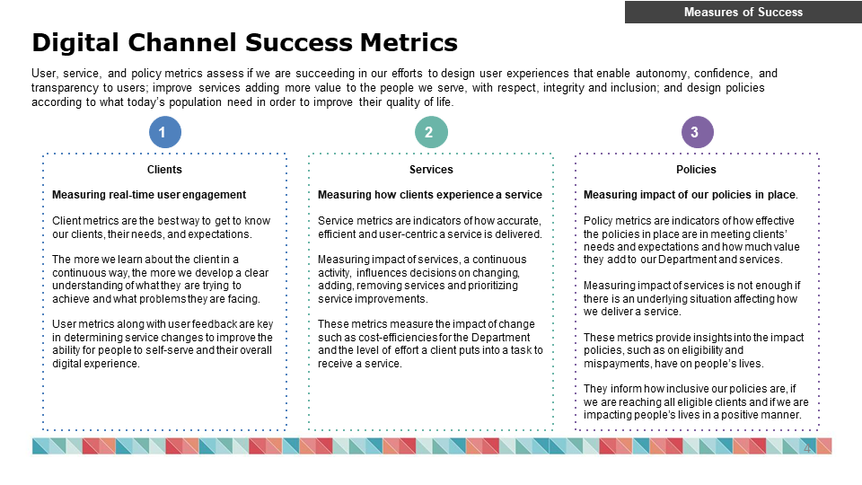
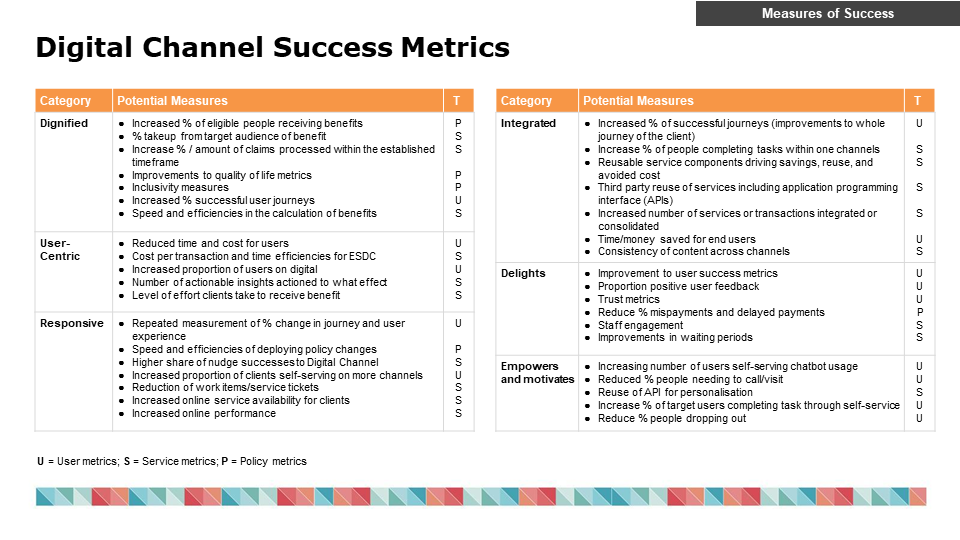
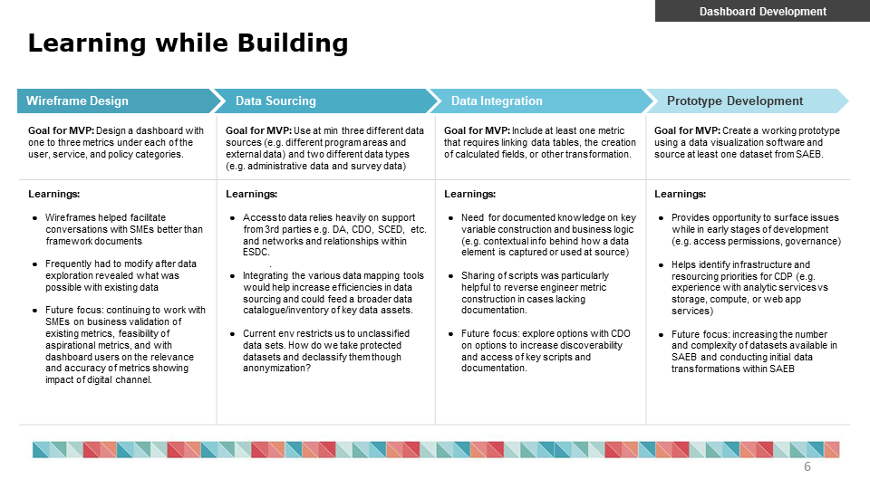

# Lessons Learned

status of design doc:

<!--  -->
<!--  -->

<!--  -->

Authors: Maciej Czop

Reviewers: 

- Christine Hagyard [X, 2021]

## Overview  

The Performance Dashboard product is a collection of Key Performance Indicators that measure the user, service and policy impacts of decisions and changes to digital services.

This "Lessons Learned" document is meant to be a repository of institutional memory for hard-won insights and understanding around the data sets, data points, metrics and KPIs cultivated and created for the dashboard.

## Context

> The Digital Channel will deliver a dignified, user centric, responsive and integrated digital journey that delights, motivates and empowers people to help themselves.

By measuring the user, service and policy metrics across channels in BDM, the analytics combined with qualitative data and user feedback will clearly demonstrate the quality of service, the impact of change to services and policies, and will ensure success is well understood, measured and connected to policy objectives 

## Goals

- Create a Performance Dashboard MVP
- Identify KPIs for user, service and policy impacts
- Measure, benchmark and track metrics that affect digital channel outcomes
- Retain contextual knowledge around data, business processes, metrics and KPIs

## Milestones 


`Start Date: June 1, 2020`

```
Milestone 1 - [ August 1, 2020 ] Create MVP Performance Dashboard
```

`End Date: TBD`


## General Lessons Learned

### 1. Omni Channel Perspective

Part of measuring the success of the work we do as a Digital Channel includes assessing the effectiveness of our services and policies from an omni channel perspective using consistent metrics across the Department.

Consistency in metrics across the ESDC improves our ability to measure client experiences as end-to-end journeys, allows for comparisons across programs, and increases our understanding of the interdependencies and cross-functional impacts of changes to departmental channels, services, policies. 

ESDC teams and performance measurement frameworks consulted to date include: Service Target Operating Model (S-TOM) and Client Experience (CX) Management, Benefits Realization, and the Integrated Service Coordination Centre (ISCC) teams. Staff from the Digital Service Directorate, Chief Data Officer, GC Web Team and Data Authority. The Client Experience (CX) Survey by CSB and ESDC Departmental Plan Results Report.

### 2. Digital Channel Success Metrics




### 3. Learning while building



## Specific Metric and KPI Lessons

### 1. % Share of recent and elgible mothers, Policy KPIs

***Data source: Employment Insurance Coverage Survey. Quebec respondent data is removed from survey tabulations***

The target population for this survey is a subset of the target population for the Labour Force Survey (LFS). 

All interviews are conducted over the telephone. The average time required to complete the survey is about seventeen minutes. 

Data collection for this reference period: 2019-04-16 to 2020-02-21

Collection cycles: There are 4 collection cycles each year. April-May, July-August, November-December and January-February. Each cycle lasts 5 weeks and begins during the month following the reference month.

Sample size: Canada - 13,229. Weighted through final weight variable provided in the EICS dataset.

More information about the 2019 EICS can be found at https://www23.statcan.gc.ca/imdb/p2SV.pl?Function=getSurvey&Id=1290741#a2

### 2. % Service Uptime Lessons

***Data Source: Canada.ca Adobe Web Analytics***

GC Web Team suggests using Daily Page Views & Visits as a proxy for service uptime as no reliable service uptime metric currently exists.

### 3.  (secs) Weekly average user time per visit

***Data Source: Canada.ca Adobe Web Analytics***

User time per visit is a controversial metric because while a service or product wants to communicate information to users as quickly and efficiently as possible, the Life Journey approach is also attempting to provide *more* holisitic information to clients than ever before - creating competing objectives and potential for perverse incentives. However, we believe the stronger argument currently is that there is room to provide current information more efficiently and keep visit times to a minimum long-term.

### 4.  (mins) Median time to submit application (2020)

***Data Source: EI Administration Data, NEIW dataset***

Metric is skewed because when a user creates an application, there is no pausing or stopping of the timer that measures application completion time. Therefor a user could close the application window, forget about the applcation entirely and the application time limit of 72 hours would be tallied and input with the data.
